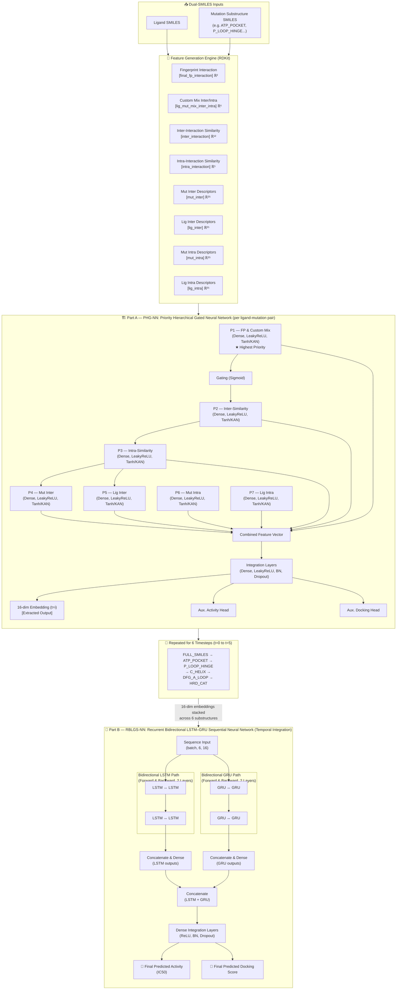
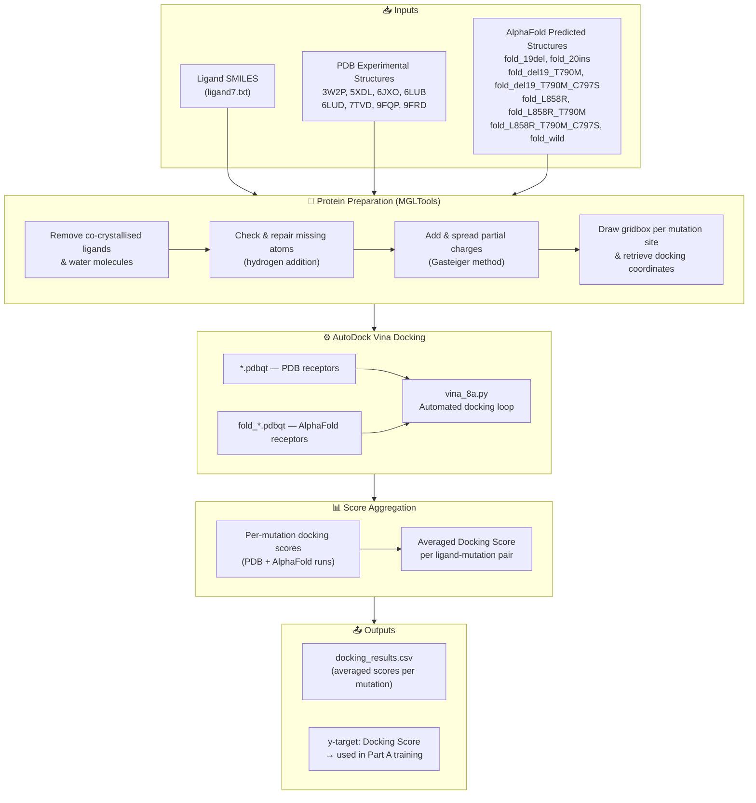
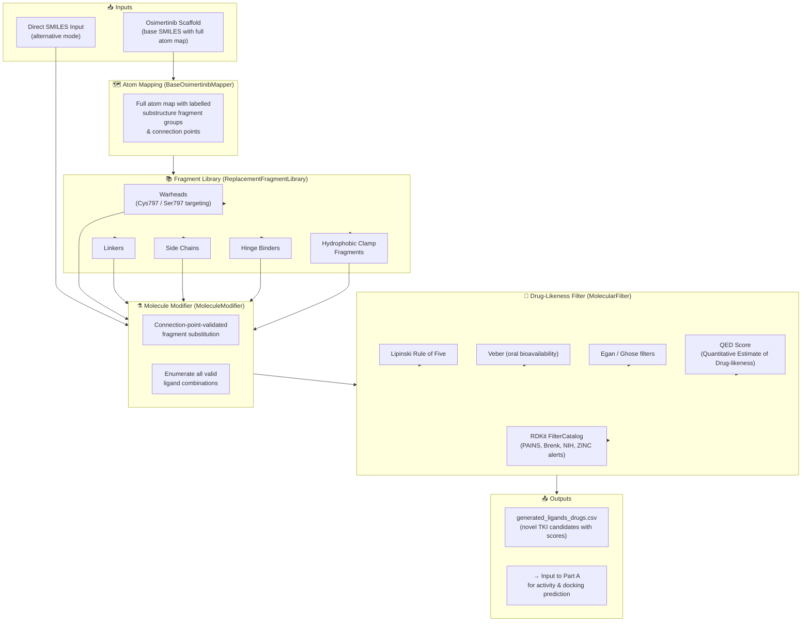

<div align="center">

# 🧬 EGFR-NSCLC Drug Discovery ML Pipeline

### Predicting 4th-Generation EGFR Inhibitor Activity Against Non-Small Cell Lung Cancer

[](https://python.org)
[](https://tensorflow.org)
[](https://rdkit.org)
[](https://pytorch.org)
[](https://vina.scripps.edu)
[](#license)

---

*An end-to-end machine learning pipeline featuring **dual-SMILES physicochemical descriptor capture** from both ligand and mutation protein — closing the interaction loop to generate intermolecular, intramolecular, similarity, fingerprint, and custom relationship features from both sides. This enables higher-accuracy prediction of drug activity (IC50) and docking scores for EGFR tyrosine kinase inhibitors targeting resistant NSCLC mutations.*

> **Associated Manuscript:** *"Dual-SMILES Feature Learning with a Hierarchical Gated Recurrent Dual KAN Network Architecture for Mutation Informed Activity Prediction of EGFR Tyrosine Kinase Inhibitors"*

</div>

---

## 📋 Table of Contents

- [Overview](#overview)
- [Motivation & Background](#motivation--background)
- [A — Activity Prediction ML Pipeline](#a--activity-prediction-ml-pipeline)
  - [Part A Architecture](#part-a-architecture)
  - [Feature Engineering](#feature-engineering)
  - [Model Architectures](#model-architectures)
  - [Script Sets (Set A & Set B)](#script-sets-set-a--set-b)
  - [Datasets](#datasets)
  - [Training & Inference](#training--inference)
- [B — Vina Molecular Docking](#b--vina-molecular-docking)
  - [Part B Architecture](#part-b-architecture)
- [C — Ligand Generator](#c--ligand-generator)
  - [Part C Architecture](#part-c-architecture)
- [Repository Structure](#repository-structure)
- [Installation & Dependencies](#installation--dependencies)
- [Usage](#usage)
- [Results](#results)
- [Assumptions & Limitations](#assumptions--limitations)
- [References](#references)
- [Acknowledgements](#acknowledgements)

---

## Overview

This project is a **drug discovery ML pipeline** for predicting **4th-generation EGFR inhibitor** activity against **Non-Small Cell Lung Cancer (NSCLC)**. It uses molecular data sourced from [ChEMBL](https://www.ebi.ac.uk/chembl/) to train neural networks that predict:

1. **Activity** — IC50 values measuring how potent a drug is against specific EGFR mutations
2. **Docking Score** — how well a drug binds to the EGFR protein across mutation variants

### 🔑 Key Differentiator: End-to-End Dual-SMILES Feature Capture

Unlike ligand-only approaches, this pipeline extracts physicochemical descriptors from **both** the ligand SMILES **and** the mutation protein substructure SMILES. This closes the interaction loop — features are generated from both sides of the binding interaction, enabling the model to learn the **relationship** between a specific ligand and a specific mutation protein pocket, rather than treating the protein as a static label.

```
Ligand SMILES ──→ Ligand Descriptors  ──┐
                                        ├──→ Interaction Features ──→ Neural Network ──→ Prediction
Mutation Protein SMILES ──→ Mutation Descriptors ──┘
                                        │
                            ┌────────────┴────────────┐
                            │  Intermolecular features │
                            │  Intramolecular features │
                            │  Similarity metrics      │
                            │  Fingerprint metrics     │
                            │  Custom relationships    │
                            └─────────────────────────┘
```

The pipeline integrates three interconnected sub-projects:

| Sub-Project | Purpose |
|---|---|
| **A. Activity Prediction** | End-to-end dual-SMILES feature capture + 4 neural network architectures for activity & docking score prediction |
| **B. Vina Docking** | Dock ligands against PDB & AlphaFold EGFR structures to generate docking scores as training targets |
| **C. Ligand Generator** | Generate novel 4th-gen TKI candidates from the osimertinib backbone with customisable fragment substitution |

---

## Motivation & Background

EGFR-mutant NSCLC is treated with **tyrosine kinase inhibitors (TKIs)**, but acquired resistance mutations progressively render each generation ineffective:

```
1st/2nd Gen TKIs ──→ Sensitising mutations (del19, L858R)
       ↓ resistance
3rd Gen TKIs (Osimertinib) ──→ T790M gatekeeper mutation
       ↓ resistance
4th Gen TKIs (needed) ──→ C797S mutation (triple mutants: del19/T790M/C797S, L858R/T790M/C797S)
```

First- and second-generation inhibitors provide median progression-free survival (PFS) of approximately 9–13 months, while osimertinib extends PFS to 10.1 months in second-line and up to 18.9 months in first-line treatment. The C797S mutation prevents covalent inhibitor binding and represents the critical new resistance barrier for 4th-generation design.

This pipeline aims to **accelerate the identification of 4th-generation EGFR-TKI candidates** by:
- Capturing ligand–mutation protein interactions through physicochemical descriptors
- Ranking novel compounds by predicted activity and docking affinity
- Generating theory-inspired ligand modifications from the osimertinib scaffold

---

## A — Activity Prediction ML Pipeline

### Part A Architecture

The Activity Prediction pipeline is built as two integrated sub-models:

- **Part A — Priority Hierarchical Gated Neural Network (PHG-NN):** Processes each ligand–mutation site pair, producing 16-dimensional embeddings via a seven-level priority hierarchy with sigmoid gating. Higher-priority features gate and control the contribution of lower-priority descriptors.
- **Part B — Recurrent Bidirectional LSTM–GRU Sequential Neural Network (RBLGS-NN):** Processes the 6-timestep sequence of 16-dim embeddings (one per EGFR substructure site) through parallel BiLSTM and BiGRU paths.



> **Multi-task training objective:** ℒ(θ) = αₐ · MSE(ŷ_activity, yₐ) + α_d · MSE(ŷ_docking, y_d), with αₐ = 1.0 (primary) and α_d = 0.6–0.7 (auxiliary). Optimiser: Adam.

> **Other Model Architectures (Dummy PhysChem, ChemBERTa, KAN)** plug into the same dual-SMILES feature generation engine and the same 6-timestep sequence structure. They differ in how the hierarchical and recurrent layers are implemented.

---

### Feature Engineering — End-to-End Dual-SMILES Descriptor Engine

The core specialty of this pipeline is its **end-to-end physicochemical descriptor capture from both the ligand and the mutation protein using SMILES**. Both molecules are passed through the same descriptor engine, and the resulting feature vectors are then combined to produce interaction-aware representations.

This dual-source approach means the model doesn't just learn "what makes a good drug" — it learns **what makes a good drug *for a specific mutation***.

#### How It Works

```
                    ┌─────────────────────┐
  Ligand SMILES ───→│  RDKit Descriptors  │───→ Ligand Inter Features (H-bond, charge, LogP, PSA...)
                    │  (same engine)      │───→ Ligand Intra Features (flexibility, rings, complexity...)
                    └─────────────────────┘
                              ↕ 
                    ┌─────────────────────┐
  Mutation SMILES ─→│  RDKit Descriptors  │───→ Mutation Inter Features
                    │  (same engine)      │───→ Mutation Intra Features
                    └─────────────────────┘
                              ↓
              ┌───────────────────────────────────────────────┐
              │            Interaction Feature Layer           │
              │  • Fingerprint overlap (Tanimoto, Dice, MFP)  │
              │  • Custom ratio / diff / product combinations  │
              │  • Inter × Inter similarity                    │
              │  • Intra × Intra similarity                    │
              │  • Mutation inter descriptors                  │
              │  • Ligand inter descriptors                    │
              │  • Mutation intra descriptors                  │
              │  • Ligand intra descriptors                    │
              └───────────────────────────────────────────────┘
                              ↓
                    8 Feature Inputs → Priority Hierarchical Model
```

#### Feature Categories & Priority Order

The PHG-NN assigns priority based on the **input order defined in the model code** — higher inputs gate and control lower-priority inputs via learned Sigmoid gates. The priority order, directly from the model definition, is:

| Priority | Feature Input | Variable Name | Dimension | Source | Description |
|:---:|---|---|:---:|---|---|
| **P1 ★ Highest** | Fingerprint Interaction | `final_fp_interaction` | ℝ² | Cross-comparison | Morgan fingerprint Tanimoto & Dice similarity between ligand and mutation SMILES |
| **P1 ★ Highest** | Custom Mix Inter/Intra | `lig_mut_mix_inter_intra` | ℝ⁶ | Combined | Physics-inspired safe-divided ratios, differences, products, and gated combinations of inter/intra features from both sides |
| **P2** | Inter-Interaction Similarity | `inter_interaction` | ℝ¹² | Cross-comparison | 10 hand-crafted molecular interaction terms + cosine similarity & sine dissimilarity between ligand & mutation intermolecular feature vectors |
| **P3** | Intra-Interaction Similarity | `intra_interaction` | ℝ⁵ | Cross-comparison | 3 hand-crafted molecular terms + cosine similarity & sine dissimilarity between ligand & mutation intramolecular feature vectors |
| **P4** | Mut Inter Descriptors | `mut_inter` | ℝ²⁵ | Mutation | Mutation intermolecular physicochemical descriptors: H-bond donors/acceptors, partial charges, LogP, PSA, hydrophobic & electrostatic descriptors |
| **P5** | Lig Inter Descriptors | `lig_inter` | ℝ²⁵ | Ligand | Ligand intermolecular physicochemical descriptors: H-bond donors/acceptors, partial charges, LogP, PSA, electrostatic descriptors |
| **P6** | Mut Intra Descriptors | `mut_intra` | ℝ²⁵ | Mutation | Mutation intramolecular physicochemical descriptors: rotatable bonds, ring count, aromaticity, sp3 fraction, molecular complexity, conjugation |
| **P7 ☆ Lowest** | Lig Intra Descriptors | `lig_intra` | ℝ²⁵ | Ligand | Ligand intramolecular physicochemical descriptors: rotatable bonds, ring count, aromaticity, sp3 fraction, molecular complexity |

> **P1 includes two inputs (Fingerprint + Custom Mix)** because both are passed into the first hierarchical block together. The Gating (Sigmoid) block then uses the combined P1 vector to gate all downstream priority levels.

> The **cross-comparison** features (P1–P3: fingerprints, similarity) are only possible *because* descriptors are generated from both molecules — this is what closes the ligand–protein interaction loop, and why they are ranked highest.

#### Hierarchical Substructure Timesteps

Features are generated **hierarchically**, looping over 6 EGFR substructure **timesteps** representing mechanistically defined structural segments of the EGFR kinase domain:

```
t=0: FULL_SMILES         → full EGFR kinase domain sequence
t=1: ATP_POCKET          → residues 718–862 (ATP-binding pocket)
t=2: P_LOOP_HINGE        → residues 719–724 (P-loop/hinge region)
t=3: C_HELIX             → residues 752–760 (αC-helix)
t=4: DFG_A_LOOP          → residues 857–859 (DFG/A-loop)
t=5: HRD_CAT             → residues 831–839 (HRD catalytic motif)
```

Each timestep captures the **mechanistic EGFR signal transduction** sequence, enabling the recurrent layers to learn structural–sequential patterns between the ligand and each region of the protein. Mutation-specific SMILES were generated from verified PDB amino acid sequences and manually generated mutant sequences; mutations not directly available in the PDB were manually introduced at the respective amino acid positions and validated using UCSF ChimeraX.

> **Disk-backed caching** is implemented in Set B (optimised scripts) to avoid redundant RDKit feature computation across runs.

---

### Model Architectures

Four neural network architectures are implemented, sharing the same feature generation pipeline but differing in their architecture:

> **Architecture diagrams** — all images are located in the `assets/` directory. Copy the uploaded architecture PNGs into `assets/` at the root of the repository for the diagrams below to render.

---

#### 1. Dummy PhysChem (Baseline FFN)

Simple multi-layer feed-forward network. Serves as a **structural null comparator** to isolate the contribution of mutation-site SMILES encoding in the advanced architectures.


The Dummy model encodes mutation identity solely as a discrete integer label fed into an embedding layer — **no protein substructure SMILES are used**. All 7 mutation-substructure descriptors are taken simultaneously as a flat, non-hierarchical input and passed through a deep MLP (Dense 1024 → 512 → 256 with ReLU, BatchNorm, Dropout). There is no priority gating, no recurrent processing, and no repeated sequence — everything is processed in a single forward pass. This isolates the contribution of feature engineering and dual-SMILES encoding from model architecture. Dual linear output heads (activity, docking) with no output bounding are used directly.

---

#### 2. ChemBERTa Cross-Attention (Benchmark)

Integrates **ChemBERTa** (pre-trained transformer for molecular SMILES, 768-dimensional embeddings) with **MultiHeadAttention** cross-attention layers. This is a natural benchmark for learned chemical representation.


ChemBERTa (768-dimensional embeddings) is extracted for the **ligand SMILES only**. Mutation identity is differentiated through a **categorical one-hot vector** — no mutation protein substructure SMILES are encoded. A **MultiHead Cross-Attention** block uses the ligand embedding as Query and the mutation one-hot as Key/Value, with a residual connection and LayerNormalization (Chem Context block). This cross-attended chemical context is then used to enhance the P1 vector in the priority hierarchy. The downstream RNN-LSTM temporal model (Part B) is identical to the Custom BiLSTM/BiGRU model.

> This design intentionally ablates the mutation SMILES encoding, providing evidence for the contribution of the dual-SMILES framework.

---

#### 3. Custom Hierarchical BiLSTM/BiGRU — PHG-NN + RBLGS-NN

The **core custom model** of the pipeline. Full formal name: **Priority Hierarchical Gated Neural Network + Recurrent Bidirectional LSTM–GRU Sequential Neural Network (PHG-NN + RBLGS-NN)**.


- **Part A (PHG-NN)** — Seven-level priority-based hierarchical gating. Higher-priority features (P1: fingerprints & custom mix) gate and control lower-priority feature contributions via learned Sigmoid gates. Each priority block uses Dense + LeakyReLU + Tanh layers. Final integration: z₀ ∈ ℝ⁶⁸ → Dense(128) → Dense(64) → Dense(32) → 16-dim embedding output.
- **Part B (RBLGS-NN)** — Bidirectional LSTM (128→64 units/direction) and Bidirectional GRU (128→64 units/direction) paths run in parallel, each processing the 6-timestep sequence of 16-dim embeddings. Their 256-dimensional concatenated output is passed through Dense Integration Layers (ReLU, BN, Dropout) to produce the final Activity (IC50) and Docking Score predictions.
- Optimiser: Adam (η = 3×10⁻³ for Part A, η = 1×10⁻³ for Part B).

---

#### 4. Hierarchical RBF-KAN + FourierKAN — FHRK-RFK

Formal name: **Forward Hierarchical RBF KAN with Recurrent Fourier KAN (FHRK-RFK)**. A dual-basis Kolmogorov–Arnold Network variant combining two mathematically distinct representations. This was the **top-performing architecture** for mutation-specific activity correlation.


- **Gaussian RBF KAN (Part A)** — Replaces all tanh Dense projections within the priority branches of the hierarchical per-site encoder with Gaussian Radial Basis Function (RBF) layers (G = 20 basis functions, grid [−2.0, +2.0]). Each edge function decomposes into a fixed SiLU linear path plus a locally adaptive non-linear spline path. The locality property ensures out-of-distribution compounds at inference time activate only nearby basis functions, keeping the learned function in the training-distribution region stable.
- **Fourier KAN (Part B)** — FourierKAN layers (G = 5 harmonics, domain [−π, +π]) are interleaved within the BiGRU sequential path at three stages: after BiGRU Layer 1 (`fourier_kan_1`), after BiGRU Layer 2 (`fourier_kan_2`), and following LSTM–GRU concatenation (`final_merged_fourier_kan`). This captures the quasi-periodic structural modulation that the ordered EGFR mutation-site sequence imposes on the downstream embedding.
- The principled separation of basis function type by representational scope — locally supported RBF functions for per-site physicochemical encoding, globally supported Fourier functions for ordered sequential mutation-site signal decomposition — constitutes the central architectural contribution of this variant.

---

### Script Sets (Set A & Set B)

Each model has **two versions** of training and prediction scripts:

| | Set A — Pseudocode | Set B — Optimised |
|---|---|---|
| **Location** | `physicochem_activity_main_pseudocode/` | `physicochem_activity_main_optimised/` |
| **Purpose** | Annotated with pseudocode comments explaining logic and rationale | Production-ready with disk-backed caching and batch processing |
| **Caching** | None | Disk-backed feature cache (`.feature_cache/`) |
| **Logging** | Basic print | Structured logging via `loguru` |
| **Use Case** | Understanding & learning | Running experiments |

Both sets contain **training scripts** (`*.py`) and **prediction/inference scripts** (`predict_*.py`) for each of the 4 model architectures.

---

### Datasets

#### Main Datasets

| Dataset | File | Description | Size |
|---|---|---|---|
| **Validated Drug TKI (full)** | `df_validated_drug_tki.csv` | Full curated EGFR TKI corpus; clinically validated IC50 values, mutation labels, and docking scores (n = 745 total) | ~7.9 MB |
| **Validated Drug TKI (test set)** | `testset_valid_tki.csv` | Blind test set of strictly validated drug TKIs held out for evaluation (n = 372) | ~3.72 MB |
| **Non-Drug TKI (training)** | `df_nondrug_tki.csv` | Larger combined training set: non-validated investigational TKIs plus 373 injected validated labels (n = 2,799) | ~26.6 MB |


#### Dataset Curation Process

Both datasets are sourced from **ChEMBL** and filtered through a rigorous pipeline. Prior studies have demonstrated that up to 65% of IC50 pairs from minimally curated ChEMBL datasets differ by more than 0.3 log units, underscoring the importance of careful curation.

```
ChEMBL Raw Data
  ├── Filter by Standard Type: Keep IC50, EC50, GI50 (activity measures)
  ├── Filter by Target: EGFR on-target only (discard ADME, off-target)
  ├── Filter by Organism: Homo sapiens (+ Mus musculus for validated set only)
  ├── Filter by Units: nM only
  ├── Remove extreme outliers: IC50 > 10,000 nM and missing values excluded
  ├── Remove salt forms from SMILES
  ├── Categorise mutations by TKD type:
  │     del19, L858R, T790M, C797S, ins20, wild
  │     (single, double, and triple mutant combinations)
  ├── Mutation-specific IC50 stratification (Dataset 1 only):
  │     Single mutants: ≤100 nM active (erlotinib, gefitinib, afatinib, dacomitinib, osimertinib, lazertinib)
  │     Double mutants: ≤140 nM active (osimertinib, lazertinib only)
  │     Triple mutants: no positive labels assigned (no validated inhibitors exist)
  ├── Manual row-level validation of IC50 ground truth (Dataset 1 only)
  ├── SMILES format: canonical SMILES (Dataset 1); isomeric SMILES (Dataset 2)
  └── Generate mutation protein SMILES & docking scores
```

**Dataset 1 — Validated Drug TKI Corpus (n = 745 total; n = 372 blind test set)**

Higher ground-truth confidence with manual IC50 filtering per mutation type. Each entry was individually validated against assay description, experimental system, mutation annotation, and reported IC50 magnitude. The total corpus is 745; half (n = 373) was injected into the non-validated corpus for ground-truth anchoring during training; the remaining n = 372 is reserved as the strict blind test set (`testset_valid_tki.csv`).

**Dataset 2 — Non-Validated TKI Corpus (n = 2,799 training)**

Larger dataset providing broad chemical diversity across non-approved and investigational TKI scaffolds. An additional 373 validated labels were injected to anchor machine learning ground truth. IC50 values were not individually validated per mutation class, presenting higher label uncertainty but greater scaffold diversity. Ground truth negative labels include rociletinib, ibrutinib, tigozertinib, crizotinib, ceritinib, brigatinib, and dasatinib (IC50 > 100 nM).

#### Dataset Augmentation — Mutation Protein Substructure SMILES

Both datasets were augmented with **eight protein substructure SMILES columns** representing wild-type, single, double, and triple mutant configurations of the EGFR kinase domain, decomposed into mechanistically relevant structural regions:

| Timestep | Region | Residues |
|:---:|---|---|
| t=0 | Full EGFR kinase domain | Full sequence |
| t=1 | ATP-binding pocket | 718–862 |
| t=2 | P-loop / hinge region | 719–724 |
| t=3 | αC-helix | 752–760 |
| t=4 | DFG/A-loop | 857–859 (L858R structural context) |
| t=5 | HRD catalytic motif | 831–839 |

#### Dataset Augmentation — Docking Score as Auxiliary Dual Target

Docking scores for each mutant protein were obtained using AutoDock Vina following protein retrieval and preparation from the PDB. The optimized docking score was calculated as the average of results from experimentally resolved PDB structures and AlphaFold-predicted models.

PDB-derived structures used:
- Del19: **7TVD** | L858R: **5XDL** | Exon 20 insertion: **9FQP** | Wild-type: **9FRD**
- L858R/T790M: **3W2P** | L858R/T790M/C797S: **6LUD**

Additional PDB structures: **6JXO**, **6LUB**. For mutations not available in the PDB (Del19/T790M, Del19/T790M/C797S), AlphaFold-predicted structures were used with mutations manually introduced at respective amino acid positions and validated in UCSF ChimeraX.

#### Training & Inference

The two datasets form a **bidirectional transfer evaluation** strategy. The limitations of each dataset are structurally complementary: Dataset 1's high fidelity but small size is compensated by Dataset 2's chemical breadth; Dataset 2's lower label confidence is anchored by Dataset 1's clinically validated ground truth.

| Run | Training Data | Evaluation Data | Train N | Eval N |
|---|---|---|:---:|:---:|
| **Run 1** (primary) | `df_nondrug_tki.csv` (broad, combined) | `testset_valid_tki.csv` (validated blind test) | 2,799 | 372 |
| **Run 2** (reversed) | Validated drug TKI split | `df_nondrug_tki.csv` (broad combined) | 373 | 2,799 |

> **Run 1** tests generalisation from broad chemical space to curated clinical compounds. **Run 2** tests generalisation from validated anchors to a structurally diverse inference library. Results were aggregated over **five independent runs with different random seeds** for robustness.

Results are saved to the `experiment_results/` folders.

---

## B — Vina Molecular Docking

**Location:** `docking_vina/`

The docking sub-project uses **AutoDock Vina** to compute binding affinities between ligands and EGFR mutation variants. Docking scores from this pipeline are used as a **secondary training target** in Part A.

### Part B Architecture



### Protein Structures

| Source | Mutations Covered | Structures |
|---|---|---|
| **PDB (Experimental)** | Del19 (7TVD), L858R (5XDL), Exon 20 insertion (9FQP), Wild-type (9FRD), L858R/T790M (3W2P), L858R/T790M/C797S (6LUD), and others | `3W2P`, `5XDL`, `6JXO`, `6LUB`, `6LUD`, `7TVD`, `9FQP`, `9FRD` |
| **AlphaFold (Predicted)** | del19, ins20, del19/T790M, del19/T790M/C797S, L858R, L858R/T790M, L858R/T790M/C797S, wild | `fold_19del`, `fold_20ins`, `fold_del19_T790M`, etc. |

### Workflow

```
1. Clean & prepare mutation proteins from PDB using MGLTools
   ├── Remove ligand & water
   ├── Check/repair missing atoms
   ├── Add & spread charges (Gasteiger method; pH not explicitly verified, tautomers not considered)
   └── Draw gridbox & retrieve coordinates

2. Generate AlphaFold structures for mutations without PDB entries
   └── Manually introduce mutations at respective amino acid positions; validate in UCSF ChimeraX

3. Dock all known ligands against both PDB and AlphaFold structures

4. Average docking scores across PDB + AlphaFold for each mutation
   → Used as y-target (auxiliary, αd = 0.6–0.7) during ML training
```

### Purpose
1. Generate reliable docking scores as a **secondary training target** alongside IC50 activity
2. Validate binding poses for known and novel ligands
3. Can be used to dock **future ligand candidates** from the ligand generator

---

## C — Ligand Generator

**Location:** `ligand_generator/`

A customised script to **generate novel 4th-generation TKI candidates** from the osimertinib backbone with precise structural modifications.

### Part C Architecture



### Architecture

```python
# Core Classes
BaseOsimertinibMapper      # Full atom map with connection points
ReplacementFragmentLibrary # Library of replacement fragments  
MoleculeModifier           # Connection-point-validated substitution
MolecularFilter            # Drug-likeness scoring
```

### Mechanism

1. **Atom Mapping** — Complete osimertinib atom map with labelled substructure fragment groups and connection points
2. **Fragment Substitution** — User-selectable replacement of specific groups:
   - Warheads (targeting Cys797 / Ser797)
   - Linkers
   - Side chains
   - Hinge binders
   - Hydrophobic clamp fragments
3. **Direct SMILES Input** — Alternative mode for direct full SMILES entry
4. **Drug-Likeness Filtering** — Multi-filter scoring system:
   - Lipinski Rule of Five
   - Veber (oral bioavailability)
   - Egan, Ghose filters
   - QED (Quantitative Estimate of Drug-likeness)
   - RDKit `FilterCatalog` (PAINS, Brenk, NIH, ZINC alerts)

### Design Rationale
- Modifications inspired by **4th-gen TKI theory**: macrocyclic inhibitors, dual warheads, enhanced hydrophobic back pocket binding
- Targets both covalent (Cys797) and non-covalent binding strategies for C797S resistance

---

## Repository Structure

```
github_ready/
│
├── 📁 physicochem_activity_main_pseudocode/    # Set A: Annotated scripts
│   ├── dummy_physchem_5f2.py                              # 0 — Baseline FFN (train)
│   ├── predict_dummy_physchem_5f2_updated.py              # 0 — Baseline FFN (predict)
│   ├── adv_physchem5f2_hierachichal_ltsm_gru_custom.py    # 1 — PHG-NN+RBLGS-NN (train)
│   ├── predict_adv_physchem5f2_hierachical_*.py            # 1 — PHG-NN+RBLGS-NN (predict)
│   ├── adv_physchem_KAN_base2_navier_stokes_sinusoid.py   # 3 — FHRK-RFK KAN (train)
│   ├── predict_adv_physchem_KAN_base2_navier_stokes.py    # 3 — FHRK-RFK KAN (predict)
│   ├── adv_physchem_chemberta_crossattention2.py          # 4 — ChemBERTa (train)
│   ├── predict_adv_physchem_chemerta_crossattention2.py   # 4 — ChemBERTa (predict)
│   ├── df_validated_drug_tki.csv                          # Validated drug dataset (full)
│   ├── df_nondrug_tki.csv                                 # Non-drug combined dataset
│   ├── egfr_tki_valid_cleaned.csv                         # Quick validation set
│   └── generated_ligands_drugs.csv                        # Generated ligands
│
├── 📁 physicochem_activity_main_optimised/     # Set B: Production scripts
│   ├── 0_dummy_physchem_5f2.py                            # 0 — Baseline FFN (train)
│   ├── 0_predict_dummy_physchem_5f2.py                    # 0 — Baseline FFN (predict)
│   ├── 1_adv_physchem5f2_hierachichal_ltsm_gru_custom.py  # 1 — PHG-NN+RBLGS-NN (train)
│   ├── 1_predict_adv_physchem5f2_hierachichal_*.py        # 1 — PHG-NN+RBLGS-NN (predict)
│   ├── 3_adv_physchem_KAN_navier_stokes_sinusoid.py       # 3 — FHRK-RFK KAN (train)
│   ├── 3_predict_adv_physchem_KAN_navier_stokes.py        # 3 — FHRK-RFK KAN (predict)
│   ├── 4_adv_physchem_chemberta_crossattention.py         # 4 — ChemBERTa (train)
│   ├── 4_predict_adv_physchem_chemberta_crossattention.py # 4 — ChemBERTa (predict)
│
├── 📁 docking_vina/                                       # Molecular docking pipeline
│   ├── vina_8a.py                                         # Docking automation script
│   ├── ligand7.txt                                        # Ligand SMILES input file
│   ├── *.pdbqt                                            # PDB protein structures (8 files)
│   └── fold_*.pdbqt                                       # AlphaFold structures (8 files)
│
├── 📁 ligand_generator/                                   # Novel ligand generation
│   └── drugs_8f3.py                                       # Interactive ligand design tool
│
├── 📁 dataset/                                            # Full dataset collection
│   ├── df_validated_drug_tki.csv                          # Validated drug dataset (full, n=745)
│   ├── testset_valid_tki.csv                              # Blind test set (n=372, ~3.72 MB)
│   ├── df_nondrug_tki.csv                                 # Non-drug combined training dataset (n=2,799)
│   └── ...                                                # Additional dataset versions
│
├── 📁 results/                                            # Experiment results
│   └── experiment_results/                                # Model outputs per run
│
└── README.md
```

---

## Installation & Dependencies

### Core Dependencies

```bash
# Core scientific stack
pip install numpy pandas scikit-learn matplotlib seaborn

# Cheminformatics
pip install rdkit-pypi

# Deep learning
pip install tensorflow>=2.0
pip install torch torchvision

# Logging
pip install loguru
```

### Model-Specific Dependencies

```bash
# For ChemBERTa Cross-Attention model
pip install transformers

# For Vina Docking
pip install vina
# Also requires: AutoDock MGLTools, Open Babel
```

### Protein Preparation Tools
- [UCSF ChimeraX](https://www.cgl.ucsf.edu/chimerax/) — Protein visualisation, preparation, and AlphaFold structure validation
- [PyMOL](https://pymol.org/) — Molecular visualisation
- [MGLTools](https://ccsb.scripps.edu/mgltools/) — AutoDock protein preparation
- [AlphaFold Server](https://alphafoldserver.com/) — Structure prediction

---

## Usage

### Training a Model

```bash
# Set B (Optimised) — Example: PHG-NN + RBLGS-NN (Hierarchical LSTM-GRU)
python physicochem_activity_main_optimised/1_adv_physchem5f2_hierachichal_ltsm_gru_custom.py \
    --train_data path/to/df_nondrug_tki.csv \
    --control_data path/to/egfr_tki_cleaned.csv \
    --drug_data path/to/generated_ligands_drugs.csv \
    --output_dir ./results
```

### Running Predictions (Inference)

```bash
# Prediction on blind test set using trained model artifacts (.h5 weights, .pkl scalers)
python physicochem_activity_main_optimised/1_predict_adv_physchem5f2_hierachichal_ltsm_gru_custom.py \
    --train_data path/to/testset_valid_tki.csv \
    --output_dir ./predictions
```

### Docking Ligands

```bash
# Add ligand SMILES to ligand7.txt, then run:
python docking_vina/vina_8a.py
# Results saved to docking_results.csv
```

### Generating Novel Ligands

```bash
# Interactive ligand design tool
python ligand_generator/drugs_8f3.py
# Follow prompts to select fragment modifications or input direct SMILES
```

---

## Results

Experiment results are stored in the `experiment_results/` folders. Four model architectures were evaluated across two experimental directions, aggregated over **five independent runs with different random seeds**. Models were assessed by MAE, RMSE, and Pearson correlation coefficient (r) across eight EGFR mutation classes.

| Direction | Trained On | Evaluated On | Train N | Eval N |
|---|---|---|:---:|:---:|
| **Run 1** (primary) | `df_nondrug_tki.csv` (broad, combined) | `testset_valid_tki.csv` (validated drugs) | 2,799 | 372 |
| **Run 2** (reversed) | Validated drug TKI split | `df_nondrug_tki.csv` (broad combined) | 373 | 2,799 |

### Key Findings

**Activity predictions show significant per-mutation correlations.** The FHRK-RFK (KAN RBF+Fourier) architecture was the **only architecture** to achieve a statistically significant overall Pearson correlation in Run 1 (r = 0.356, p < 0.001, n = 372) and the only model to produce all positive directional correlations across all eight mutations. Per-mutation highlights:
- Del/T790M double: **r = 0.910** (p = 2.57 × 10⁻⁴, n = 10, ***)
- Del/T790M/C797S triple: **r = 0.810** (p = 2.55 × 10⁻⁴, n = 15, ***)
- Ins 20: **r = 0.598** (p = 1.58 × 10⁻³, n = 25, **)
- L858R/T790M double: **r = 0.556** (p = 2.02 × 10⁻¹¹, n = 124, ***)
- Wild-Type: **r = 0.452** (p = 7.55 × 10⁻⁵, n = 71, ***)

In the reversed direction (Run 2, n = 2,799), the KAN model demonstrated the most consistent significant positive correlations simultaneously across five mutation classes: Del/T790M (r = 0.600, p = 3.82 × 10⁻²¹, ***), Ins 20 (r = 0.500, p = 2.16 × 10⁻¹³, ***), L858R/T790M (r = 0.392, p = 5.84 × 10⁻²², ***), Del/T790M/C797S (r = 0.265, p = 0.0038, **), and L858R/T790M/C797S (r = 0.252, p = 1.27 × 10⁻⁸, ***). Overall KAN r = 0.213 (p = 5.96 × 10⁻³⁰, ***).

ChemBERTa achieved the highest per-class activity correlation for L858R/T790M double in Run 1 (r = 0.688, p = 1.06 × 10⁻¹⁸, ***), but did not achieve a statistically significant overall result.

**Docking score predictions yield strong correlations.** All four architectures produced substantially stronger correlations for docking scores than for biological activity, reflecting the more deterministic nature of the molecular docking scoring function. The ChemBERTa model achieved the highest overall docking correlation in Run 1 (r = 0.758, p = 1.04 × 10⁻⁷⁰, ***). The KAN RBF+Fourier model achieved significant positive correlations across seven of eight mutation classes in Run 1 (overall r = 0.737, p = 5.33 × 10⁻⁶⁵, ***). In Run 2, ChemBERTa showed the strongest overall docking r = 0.350 (p = 1.16 × 10⁻⁸¹, ***); KAN retained r = 0.183 (p = 1.74 × 10⁻²², ***).

**Distribution shift and numerical instability.** The Dummy PhysChem baseline exhibited severe numerical instability under distribution shift in Run 2, with MAE values reaching 3.94 × 10⁶ nM for Del/Exon 19 and 4.16 × 10⁵ nM for Wild-Type, demonstrating the necessity of dual-SMILES encoding and proper neural architectures for stable generalisation.

Each run produces: trained model weights (`.h5`), feature scalers (`.pkl`), training/validation loss curves, and prediction CSVs with activity and docking score estimates.

---

### Run 1: Validated Drug TKI Test Set (Activity IC₅₀) — n = 372

> Training: combined non-drug dataset (n = 2,799); Evaluation: validated blind test set (n = 372). All errors in nM.

| Mutation | N | Dummy PhysChem MAE | Dummy PhysChem RMSE | Dummy PhysChem r | Adv BiLSTM/BiGRU MAE | Adv BiLSTM/BiGRU RMSE | Adv BiLSTM/BiGRU r | ChemBERTa MAE | ChemBERTa RMSE | ChemBERTa r | KAN RBF+Fourier MAE | KAN RBF+Fourier RMSE | KAN RBF+Fourier r |
|---|:---:|---|---|---|---|---|---|---|---|---|---|---|---|
| Del (Exon 19) | 52 | 355.5 | 369.0 | 0.169 | 890.2 | 923.4 | -0.005 | 162.0 | 190.4 | 0.019 | 154.0 | 175.2 | **0.219** |
| L858R | 49 | 32.7 | 40.6 | -0.062 | 900.3 | 919.7 | 0.200 | 53.4 | 65.0 | -0.012 | 63.8 | 86.4 | 0.081 |
| Del/T790M | 10 | 2775.7 | 4420.3 | 0.583 | 3096.5 | 4281.2 | -0.435 | 2815.9 | 4588.8 | 0.485 | 2760.4 | 4496.3 | **0.910 ★** |
| L858R/T790M | 124 | 1467.5 | 3388.6 | 0.565 | 1819.7 | 3129.6 | 0.250 | 1451.8 | 3360.2 | **0.688 ★** | 1466.2 | 3382.0 | 0.556 |
| Del/T790M/C797S | 15 | 2728.5 | 4096.3 | 0.727 | 2113.5 | 3659.8 | -0.080 | 2705.0 | 4072.1 | 0.435 | 2623.5 | 3986.3 | **0.810 ★** |
| L858R/T790M/C797S | 26 | 1898.7 | 2698.2 | 0.277 | 1692.7 | 2265.5 | 0.217 | 1957.3 | 2754.7 | -0.055 | 2013.6 | 2795.2 | 0.108 |
| Ins 20 | 25 | 891.8 | 1794.2 | -0.292 | 1193.9 | 1653.0 | -0.040 | 950.6 | 1782.2 | -0.041 | 854.1 | 1781.9 | **0.598 ★** |
| Wild-Type | 71 | 1161.6 | 1944.9 | 0.236 | 1028.2 | 1629.2 | -0.177 | 1047.0 | 1849.1 | -0.019 | 1136.5 | 1909.3 | **0.452 ★** |
| **All (Overall)** | **372** | 1142.1 | 2548.7 | 0.087 | 1412.8 | 2361.6 | 0.036 | 1098.9 | 2529.9 | 0.075 | 1113.7 | 2541.1 | **0.356 ★** |

★ = statistically significant (p < 0.01 or better).

---

### Run 2: Large Combined Dataset (Activity IC₅₀) — n = 2,799

> Training: validated drug TKI split (n = 373); Evaluation: combined non-drug dataset (n = 2,799). All errors in nM.

| Mutation | N | Dummy PhysChem MAE | Dummy PhysChem RMSE | Dummy PhysChem r | Adv BiLSTM/BiGRU MAE | Adv BiLSTM/BiGRU RMSE | Adv BiLSTM/BiGRU r | ChemBERTa MAE | ChemBERTa RMSE | ChemBERTa r | KAN RBF+Fourier MAE | KAN RBF+Fourier RMSE | KAN RBF+Fourier r |
|---|:---:|---|---|---|---|---|---|---|---|---|---|---|---|
| Del (Exon 19) | 256 | 3.94×10⁶ | 6.30×10⁷ | -0.029 | 1008.2 | 2400.9 | 0.148 | 1008.1 | 2416.9 | 0.028 | 1010.1 | 2422.8 | -0.007 |
| L858R | 498 | 1355.4 | 3897.6 | -0.016 | 1173.0 | 2965.3 | -0.064 | 1167.6 | 2935.5 | 0.123 | 1188.3 | 2980.2 | -0.014 |
| Del/T790M | 202 | 1363.5 | 5177.6 | 0.126 | 1286.2 | 2853.8 | 0.159 | 1129.7 | 2386.6 | **0.506 ★** | 1041.1 | 2241.3 | **0.600 ★** |
| L858R/T790M | 558 | 5596.0 | 63710.2 | -0.014 | 837.2 | 2311.5 | -0.079 | 1136.2 | 4453.3 | 0.027 | 910.1 | 2034.1 | **0.392 ★** |
| Del/T790M/C797S | 118 | 3217.1 | 21789.6 | -0.041 | 401.5 | 1060.6 | 0.030 | 440.3 | 1132.0 | **0.261 ★** | 513.9 | 1047.1 | **0.265 ★** |
| L858R/T790M/C797S | 496 | 15447.4 | 297062.3 | -0.017 | 734.1 | 2178.6 | 0.051 | 954.9 | 2546.1 | 0.020 | 943.0 | 2044.4 | **0.252 ★** |
| Ins 20 | 190 | 1481.3 | 2225.6 | -0.144 | 231.3 | 565.1 | -0.191 | 283.3 | 569.7 | **0.385 ★** | 204.8 | 473.4 | **0.500 ★** |
| Wild-Type | 481 | 4.16×10⁵ | 6.45×10⁶ | -0.019 | 1451.5 | 3101.7 | -0.241 | 3332.1 | 22046.7 | 0.059 | 1495.5 | 3008.5 | -0.058 |
| **All (Overall)** | **2,799** | 4.36×10⁵ | 1.92×10⁷ | -0.008 | 972.8 | 2511.6 | -0.056 | 1387.6 | 9549.1 | 0.045 | 1020.0 | 2379.5 | **0.213 ★** |

★ = statistically significant (p < 0.01 or better).

---

### Run 1: Validated Drug TKI Test Set (Docking Score) — n = 372

> Units: kcal/mol.

| Mutation | N | Dummy PhysChem MAE | Dummy PhysChem RMSE | Dummy PhysChem r | ChemBERTa MAE | ChemBERTa RMSE | ChemBERTa r | Adv BiLSTM/BiGRU MAE | Adv BiLSTM/BiGRU RMSE | Adv BiLSTM/BiGRU r | KAN RBF+Fourier MAE | KAN RBF+Fourier RMSE | KAN RBF+Fourier r |
|---|:---:|---|---|---|---|---|---|---|---|---|---|---|---|
| Del (Exon 19) | 52 | 0.18 | 0.19 | 0.949 | 0.20 | 0.25 | 0.857 | 2.86 | 3.22 | 0.693 | 0.31 | 0.39 | 0.781 |
| L858R | 49 | 0.29 | 0.37 | 0.748 | 0.26 | 0.39 | 0.788 | 2.53 | 3.11 | 0.197 | 0.30 | 0.45 | 0.636 |
| Del/T790M | 10 | 0.27 | 0.31 | 0.929 | 0.27 | 0.29 | 0.934 | 2.07 | 2.54 | 0.510 | 0.36 | 0.36 | 0.869 |
| L858R/T790M | 124 | 0.20 | 0.21 | 0.963 | 0.31 | 0.35 | 0.773 | 2.94 | 3.28 | 0.677 | 0.13 | 0.19 | **0.949** |
| Del/T790M/C797S | 15 | 0.20 | 0.28 | 0.709 | 0.34 | 0.41 | **0.960** | 3.29 | 3.50 | 0.966 | 0.15 | 0.31 | 0.058 |
| L858R/T790M/C797S | 26 | 0.09 | 0.16 | 0.948 | 0.27 | 0.31 | 0.865 | 3.59 | 3.66 | 0.786 | 0.17 | 0.22 | 0.727 |
| Ins 20 | 25 | 0.95 | 0.97 | 0.919 | 0.81 | 0.91 | 0.603 | 2.28 | 2.50 | 0.333 | 0.92 | 0.94 | **0.954** |
| Wild-Type | 71 | 0.31 | 0.34 | 0.698 | 0.14 | 0.20 | 0.787 | 2.41 | 2.69 | 0.182 | 0.46 | 0.49 | 0.687 |
| **All (Overall)** | **372** | 0.28 | 0.36 | 0.792 | 0.29 | 0.38 | **0.758** | 2.76 | 3.12 | 0.347 | 0.30 | 0.42 | 0.737 |

---

### Run 2: Large Combined Dataset (Docking Score) — n = 2,799

> Units: kcal/mol.

| Mutation | N | Dummy PhysChem MAE | Dummy PhysChem RMSE | Dummy PhysChem r | ChemBERTa MAE | ChemBERTa RMSE | ChemBERTa r | Adv BiLSTM/BiGRU MAE | Adv BiLSTM/BiGRU RMSE | Adv BiLSTM/BiGRU r | KAN RBF+Fourier MAE | KAN RBF+Fourier RMSE | KAN RBF+Fourier r |
|---|:---:|---|---|---|---|---|---|---|---|---|---|---|---|
| Del (Exon 19) | 256 | 0.50 | 0.82 | 0.249 | 0.40 | 0.54 | 0.436 | 0.50 | 0.60 | 0.054 | 0.56 | 0.75 | 0.067 |
| L858R | 498 | 0.63 | 0.91 | 0.407 | 0.60 | 0.80 | 0.328 | 0.79 | 1.00 | 0.149 | 0.76 | 1.00 | 0.155 |
| Del/T790M | 202 | 0.78 | 0.99 | -0.003 | 0.39 | 0.51 | 0.235 | 0.45 | 0.56 | -0.073 | 0.59 | 0.72 | -0.005 |
| L858R/T790M | 558 | 0.39 | 0.60 | 0.659 | 0.52 | 0.73 | 0.407 | 0.72 | 0.92 | 0.203 | 0.54 | 0.75 | 0.378 |
| Del/T790M/C797S | 118 | 1.15 | 3.10 | 0.016 | 0.88 | 3.02 | 0.263 | 1.09 | 3.19 | -0.132 | 0.94 | 3.12 | -0.116 |
| L858R/T790M/C797S | 496 | 0.56 | 0.77 | 0.552 | 0.68 | 0.88 | 0.180 | 0.95 | 1.13 | 0.227 | 0.66 | 0.84 | 0.237 |
| Ins 20 | 190 | 1.26 | 1.52 | -0.207 | 0.54 | 0.68 | 0.500 | 0.54 | 0.66 | -0.073 | 0.95 | 1.12 | 0.116 |
| Wild-Type | 481 | 0.63 | 0.80 | 0.441 | 0.93 | 1.16 | 0.221 | 1.49 | 1.68 | 0.021 | 0.92 | 1.16 | -0.006 |
| **All (Overall)** | **2,799** | 0.63 | 1.06 | 0.369 | 0.63 | 1.02 | **0.350** | 0.87 | 1.25 | 0.032 | 0.72 | 1.11 | 0.183 |

---

## Assumptions & Limitations

### Modeling Assumptions

| # | Assumption |
|---|---|
| 1 | 1st/2nd generation TKIs effective only on single mutants (del19, L858R) |
| 2 | 3rd generation TKIs effective on single + double mutants (+ T790M) |
| 3 | No existing TKI is effective on triple mutants (del19/T790M/C797S or L858R/T790M/C797S) |
| 4 | Exon 20 insertion mutations are uncertain due to heterogeneous drug sensitivity profiles |
| 5 | Wild-type EGFR activity not assumed; excluded from mutation-specific modeling framework |
| 6 | Docking scores reflect meaningful binding to mutation proteins |
| 7 | Averaging PDB + AlphaFold docking scores reduces uncertainty |
| 8 | Physicochemical descriptors adequately capture intermolecular/intramolecular forces |

### Limitations

| Area | Limitation |
|---|---|
| **Data** | Dataset 1 (n = 745) has uneven representation across mutation categories, particularly for less-studied single, double, and triple mutant configurations |
| **Data** | Non-drug TKI dataset has higher label uncertainty — IC50 values not individually validated per mutation class |
| **Data** | User-directed curation introduces potential selection bias; mutation-specific IC50 thresholds encode generation-specific assumptions |
| **Model** | Risk of overfitting on small validated dataset (n = 373 training in Run 2) |
| **Model** | Overlapping representations of bonding forces in descriptor categories; structural overlap inherent in SMILES pairing across mutations |
| **Model** | Framework limited to 1D (SMILES-derived) descriptors; 3D spatial conformations, atomic coordinates, protein dynamics, and solvent effects are not explicitly modelled |
| **Model** | Covariate shift between training and inference distributions can degrade generalisation, particularly for the tanh-based BiLSTM/BiGRU |
| **Docking** | Not all PDB structures directly available; some are AlphaFold predictions |
| **Docking** | Protein preparation subject to user error; charges spread by Gasteiger method; pH not verified; tautomers not considered |
| **Docking** | Docking scores showed limited mutation-discriminative information relative to IC50-based activity predictions |
| **Ligand Gen** | Theory-inspired modifications specific to EGFR NSCLC TKIs |
| **Ligand Gen** | Does not consider receptor dimerisation, bypass signalling mechanisms, or off-target effects |

---

## References

### Journal References

1. Passaro, A.; Jänne, P. A.; Mok, T.; Peters, S. Overcoming Therapy Resistance in EGFR-Mutant Lung Cancer. Nat. Cancer 2021, 2 (April). https://doi.org/10.1038/s43018-021-00195-8.
2. Ferro, A.; Marco, G.; Mulargiu, C.; Marino, M.; Pasello, G.; Guarneri, V.; Bonanno, L. Critical Reviews in Oncology / Hematology The Study of Primary and Acquired Resistance to First-Line Osimertinib to Improve the Outcome of EGFR-Mutated Advanced Non-Small Cell Lung Cancer Patients : The Challenge Is Open for New Therapeutic Strategies. Crit. Rev. Oncol. / Hematol. 2024, 196 (February), 104295. https://doi.org/10.1016/j.critrevonc.2024.104295.
3. Cherkasov, A.; Muratov, E. N.; Fourches, D.; Varnek, A.; et al. QSAR Modeling: Where Have You Been? Where Are You Going to? 2013.
4. Admin-, D. Discovery. 2022, No. 10. https://doi.org/10.1016/j.drudis.2022.07.004.
5. Tropsha, A.; Isayev, O.; Varnek, A.; Schneider, G.; Cherkasov, A. Integrating QSAR Modelling and Deep Learning in Drug Discovery: The Emergence of Deep QSAR. https://doi.org/10.1038/s41573-023-00832-0.
6. Ponzoni, I.; Sebastián-pérez, V.; Requena-triguero, C.; et al. Hybridizing Feature Selection and Feature Learning Approaches in QSAR Modeling for Drug Discovery. 2017. https://doi.org/10.1038/s41598-017-02114-3.
7. Hunter, F. M. I.; Ioannidis, H.; Patr, A.; Bosc, N.; et al. Drug and Clinical Candidate Drug Data in ChEMBL. 2025. https://doi.org/10.1021/acs.jmedchem.5c00920.
8. Zdrazil, B. Fifteen Years of ChEMBL and Its Role in Cheminformatics and Drug Discovery. 2025.
9. Landrum, G. A.; Riniker, S. Combining IC50 Or. 2024. https://doi.org/10.1021/acs.jcim.4c00049.
10. Kalliokoski, T.; Kramer, C.; Vulpetti, A.; Gedeck, P. Comparability of Mixed IC50 Data – A Statistical Analysis. 2013, 8 (4). https://doi.org/10.1371/journal.pone.0061007.
11. McGaughey, G.; Walters, W. P.; Goldman, B.; Vogt, M. Understanding Covariate Shift in Model Performance. 2025, 5 (May), 1–13.
12. Joshi, A.; Kaushik, V. Insights of Molecular Docking in Autodock-Vina: A Practical Approach. 2021, 9, 1–6.
13. Mey, A. S. J. S.; Gorantla, R. From Proteins to Ligands: Decoding Deep Learning Methods for Binding Affinity Prediction. 2024. https://doi.org/10.1021/acs.jcim.3c01208.
14. Bajusz, D.; Rácz, A.; Héberger, K. Why Is Tanimoto Index an Appropriate Choice for Fingerprint-Based Similarity Calculations? J. Cheminform. 2015, 1–13. https://doi.org/10.1186/s13321-015-0069-3.
15. LeCun, Y.; Bengio, Y.; Hinton, G. Deep Learning. 2015. https://doi.org/10.1038/nature14539.
16. Huguenin-Dumittan, K. K.; Loche, P.; Haoran, N.; Ceriotti, M. Physics-Inspired Equivariant Descriptors of Nonbonded Interactions. 2023. https://doi.org/10.1021/acs.jpclett.3c02375.
17. Tretiakov, S.; Nigam, A.; Pollice, R. Studying Noncovalent Interactions in Molecular Systems with Machine Learning. 2025. https://doi.org/10.1021/acs.chemrev.4c00893.
18. Li, J.; Cai, R.; Wang, Z.; Sun, Y.; Yang, W.; Hu, Y. PLXFPred: Interpretable Cross-Attention Networks with Hierarchical Fusion of Multi-Modal Features for Predicting Protein–Ligand Interactions and Affinities. 2026, 42 (November 2025), 1–11.
19. Zhu, W.; Zhang, Y.; Zhao, D.; Xu, J.; Wang, L. HiGNN: A Hierarchical Informative Graph Neural Network for Molecular Property Prediction Equipped with Feature-Wise Attention. J. Chem. Inf. Model. 2023, 63 (1), 43–55. https://doi.org/10.1021/acs.jcim.2c01099.
20. Lilhore, U. K.; Simiaya, S.; Alhussein, M.; Faujdar, N.; Dalal, S. Optimizing Protein Sequence Classification: Integrating Deep Learning Models with Bayesian Optimization for Enhanced Biological Analysis. 2024.
21. Zarzycki, K. LSTM and GRU Type Recurrent Neural Networks in Model Predictive Control: A Review. Neurocomputing 2025, 632 (October 2024).
22. Berglund, M.; Leo, K. Bidirectional Recurrent Neural Networks as Generative Models. 1–9.
23. Liu, Z.; Wang, Y.; Vaidya, S.; Ruehle, F.; Halverson, J.; Soljačić, M.; et al. KAN: Kolmogorov–Arnold Networks. 2025, 1–50.
24. Li, L.; Zhang, Y.; Wang, G.; Xia, K. Kolmogorov–Arnold Graph Neural Networks for Molecular Property Prediction. Nat. Mach. Intell. 2025. https://doi.org/10.1038/s42256-025-01087-7.
25. Chithrananda, S.; Ramsundar, B. ChemBERTa: Large-Scale Self-Supervised Pretraining for Molecular Property Prediction. 2020, NeurIPS.
26. Praski, M.; Adamczyk, J.; Czech, W. Benchmarking Pretrained Molecular Embedding Models for Molecular Representation Learning.
27. Noviandy, T. R.; Idroes, G. M.; Patwekar, M.; Idroes, R. Fine-Tuning ChemBERTa for Predicting Activity of AXL Kinase Inhibitors in Oncogenic Target Modeling. 2025, 3 (2). https://doi.org/10.61975/gjset.v3i2.98.
28. Bu, Y.; Gao, R.; Zhang, B.; Zhang, L.; Sun, D. CoGT: Ensemble Machine Learning Method and Its Application. 2023. https://doi.org/10.1021/acsomega.3c00160.
29. van Tilborg, D.; Alenicheva, A.; Grisoni, F. Exposing the Limitations of Molecular Machine Learning with Activity Cliffs. 2022. https://doi.org/10.1021/acs.jcim.2c01073.
30. Deng, J.; Yang, Z.; Wang, H.; Ojima, I.; Samaras, D.; Wang, F. A Systematic Study of Key Elements Underlying Molecular Property Prediction. 2023. https://doi.org/10.1038/s41467-023-41948-6.
31. Wieder, O.; Kohlbacher, S.; Kuenemann, M.; et al. A Compact Review of Molecular Property Prediction with Graph Neural Networks. Drug Discov. Today Technol. 2020, 1–12. https://doi.org/10.1016/j.ddtec.2020.11.009.
32. Genet, R.; Inzirillo, H. TKAN: Temporal Kolmogorov-Arnold Networks. 1–6.
33. Alahakoon, A. M. H. H. Approximate Multiplier Induced Error Propagation in Deep Neural Networks.
34. Klarner, L.; Rudner, T. G. J.; Reutlinger, M.; et al. Domain-Informed Prior Distributions over Functions. 2023.
35. Chiu, S.; Cheung, S. W.; Braga-Neto, U.; Lee, C. S.; Li, R. P. Free-RBF-KAN: Kolmogorov-Arnold Networks with Adaptive Radial Basis Functions for Efficient Function Learning. 2025, 27344 (25), 1–16.
36. Ta, H. BSRBF-KAN: A Combination of B-Splines and Radial Basis Functions in Kolmogorov-Arnold Networks.
37. Zhang, J.; Fan, Y.; Cai, K.; Wang, K. Kolmogorov-Arnold Fourier Networks. 2024.

### Tools & Libraries

- [RDKit](https://rdkit.org/) — Cheminformatics toolkit
- [TensorFlow](https://tensorflow.org/) / [Keras](https://keras.io/) — Deep learning framework
- [PyTorch](https://pytorch.org/) — ChemBERTa backend
- [HuggingFace Transformers](https://huggingface.co/seyonec/ChemBERTa-zinc-base-v1) — ChemBERTa model
- [AutoDock Vina](https://vina.scripps.edu/) — Molecular docking
- [PePSMI](https://novopro.cn/tools/pepsmi) / [Novopro](https://novopro.cn/) — Peptide SMILES
- [UCSF ChimeraX](https://www.cgl.ucsf.edu/chimerax/) / [PyMOL](https://pymol.org/) — Protein visualisation and structure validation
- [MGLTools](https://ccsb.scripps.edu/mgltools/) — AutoDock protein preparation
- [AlphaFold Server](https://alphafoldserver.com/) — Predicted protein structures

---

## Acknowledgements

Special Thanks to Arshath for his ML Expertise and Experience throughout the entire project! (https://github.com/moarshy)

- **Claude AI** and **Antigravity (VS Code)** were used to assist with debugging, model architecture design, hierarchical categorisation, and file operations during code development.
- **ChEMBL** database for providing the molecular bioactivity data.
- **AlphaFold** for predicted protein structures where PDB entries were unavailable.

---

<div align="center">

*Built for accelerating 4th-generation EGFR-TKI drug discovery against resistant NSCLC mutations.*

</div>
